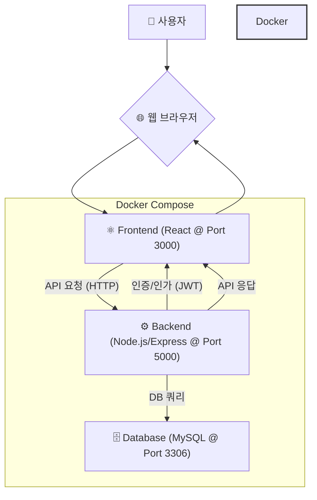
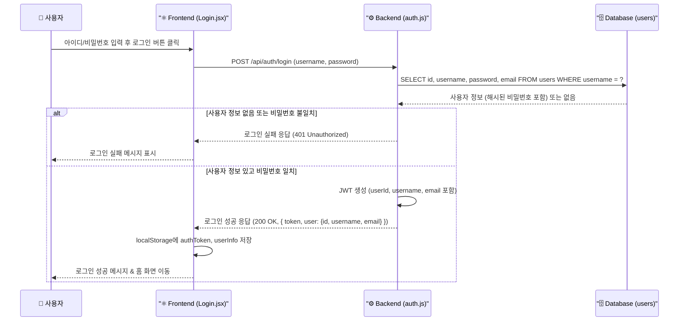
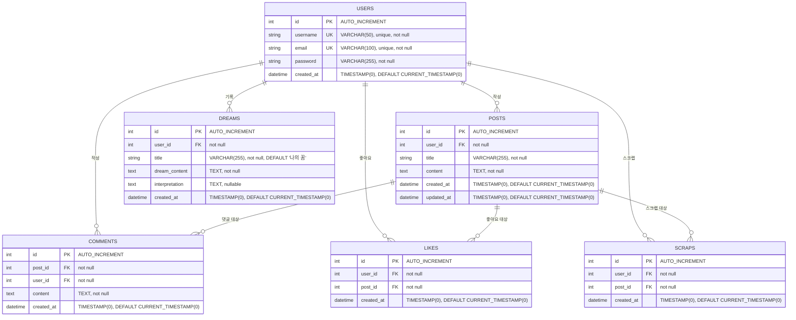

# 나의 꿈 해몽 서비스 (Dream Interpreter Service)

(프로젝트에 대한 간략한 소개를 여기에 작성하세요. 예: 사용자의 꿈 내용을 입력받아 해석 결과를 제공하고, 관련 커뮤니티 기능을 제공하는 웹 서비스입니다.)

## 1. 시스템 아키텍처

프로젝트의 전체적인 구성 요소와 상호작용은 다음과 같습니다.



*   **사용자**: 웹 브라우저를 통해 서비스에 접근합니다.
*   **Frontend**: React 기반의 사용자 인터페이스를 제공하며, 사용자의 입력을 받아 백엔드 API를 호출합니다. (Docker 컨테이너)
*   **Backend**: Node.js/Express 기반의 API 서버로, 비즈니스 로직 처리, 데이터베이스 연동, JWT 기반 인증/인가를 담당합니다. (Docker 컨테이너)
*   **Database**: MySQL을 사용하여 사용자 정보, 꿈 내용, 해석 결과, 게시글 등 데이터를 영구 저장합니다. (Docker 컨테이너)
*   **Docker Compose**: 프론트엔드, 백엔드, 데이터베이스 컨테이너를 정의하고 실행하여 개발 및 배포 환경을 관리합니다.

## 2. 주요 데이터 흐름 (로그인 예시)

사용자가 로그인을 시도할 때의 데이터 흐름 예시입니다.



1.  사용자가 로그인 정보를 입력하고 버튼을 클릭합니다.
2.  프론트엔드는 입력받은 정보를 백엔드의 로그인 API로 전송합니다.
3.  백엔드는 데이터베이스에서 해당 사용자 정보를 조회합니다.
4.  데이터베이스는 조회 결과를 백엔드에 반환합니다.
5.  백엔드는 입력된 비밀번호와 데이터베이스의 해시된 비밀번호를 비교합니다.
6.  (성공 시) 백엔드는 JWT(JSON Web Token)를 생성하고, 사용자 정보(id, username, email 포함)와 함께 성공 응답을 프론트엔드로 보냅니다.
7.  (실패 시) 백엔드는 실패 응답을 보냅니다.
8.  프론트엔드는 성공 응답을 받으면 토큰과 사용자 정보를 브라우저의 `localStorage`에 저장하고, 사용자에게 성공 피드백을 주며 홈 화면 등으로 이동합니다.

## 3. 데이터베이스 ERD

`backend/prisma/migrations`의 SQL 스키마를 바탕으로 생성한 데이터베이스 구조입니다.



*   **USERS**: 사용자 정보 (PK: `id`, UK: `username`, `email`)
*   **POSTS**: 게시글 정보 (FK: `user_id` -> `USERS`.`id`)
*   **DREAMS**: 사용자가 기록한 꿈 내용 및 해석 (FK: `user_id` -> `USERS`.`id`)
*   **COMMENTS**: 게시글 댓글 (FK: `post_id` -> `POSTS`.`id`, FK: `user_id` -> `USERS`.`id`)
*   **LIKES**: 게시글 좋아요 정보 (FK: `user_id` -> `USERS`.`id`, FK: `post_id` -> `POSTS`.`id`, UK: `user_id`+`post_id`)
*   **SCRAPS**: 게시글 스크랩 정보 (FK: `user_id` -> `USERS`.`id`, FK: `post_id` -> `POSTS`.`id`, UK: `user_id`+`post_id`)

(참고: `updated_at` 컬럼의 `ON UPDATE CURRENT_TIMESTAMP` 동작은 `ALTER TABLE`로 추가되거나, 기본값이 설정된 것일 수 있습니다. `CREATE TABLE` 문에는 해당 내용이 명시되어 있지 않습니다. `roles` 컬럼은 현재 스키마에는 존재하지 않습니다.)

## 4. 기술 스택

*   **Frontend**: React, Axios, Chakra UI
*   **Backend**: Node.js, Express, bcrypt, jsonwebtoken, mysql2
*   **Database**: MySQL
*   **Environment**: Docker, Docker Compose
*   **Version Control**: Git

## 5. 설치 및 실행 (예시)

```bash
# 1. 저장소 클론
git clone [저장소 URL]
cd [프로젝트 디렉토리]

# 2. 환경 변수 설정
# backend/.env 파일 생성 및 필요한 환경 변수 설정 (DB 정보, JWT 비밀키 등)
# 예시:
# DB_HOST=db
# DB_USER=root
# DB_PASSWORD=yourpassword
# DB_DATABASE=dream_interpreter_db
# JWT_SECRET=your_jwt_secret_key
# OPENAI_API_KEY=your_openai_key (필요시)

# 3. Docker 컨테이너 빌드 및 실행 (백그라운드)
docker compose up --build -d

# 4. 서비스 접속
# Frontend: http://localhost:3000
# Backend API: http://localhost:5000

# 5. Docker 컨테이너 중지
docker compose down
```

(이 README 내용은 프로젝트 진행 상황에 따라 지속적으로 업데이트되어야 합니다.)
